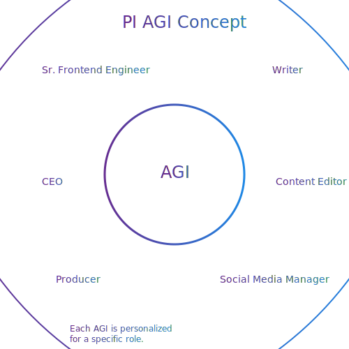
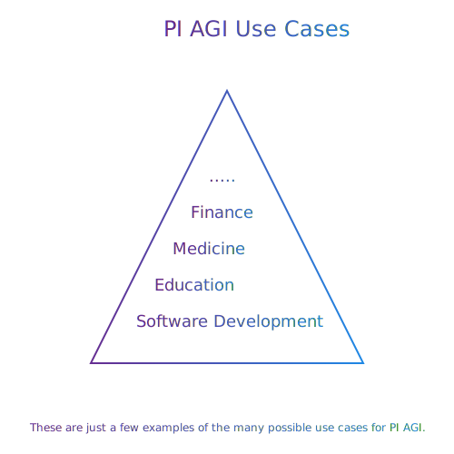

# PI AGI: Personalized Artificial General Intelligence

Welcome to PI AGI, a groundbreaking project that aims to revolutionize the world of Artificial Intelligence. By developing a base for role-based AGIs (Artificial General Intelligences) that are personalized and optimized for specific tasks, we can unlock the true power and meaning of AGI.

## Table of Contents

- [The Ultimate Vision](#sparkles-the-ultimate-vision)
- [Getting Started](#rocket-getting-started)
- [Repository Overview](#wrench-repository-overview)
  - [Environment Parameters](#environment-parameters)
  - [Working Styles](#working-styles)
  - [Project Goal](#project-goal)
- [Get Involved](#star-get-involved)
  - [Donations](#donations)
  - [Contributors](#contributors)
- [Join the Community](#handshake-join-the-community)

## :sparkles: The Ultimate Vision

Imagine a world where personalized AGIs are seamlessly integrated into our daily lives, enhancing productivity and creativity across various domains, such as software development, medicine, finance, and more. With PI AGI, we strive to make this dream a reality by building a foundation for AGIs that are tailored to specific roles and responsibilities.

## :rocket: Getting Started

Follow these steps to start exploring the world of PI AGI:

1. Clone the repository and navigate to the project folder.
2. Run `npm install` to install the required dependencies.
3. Configure the environment parameters as mentioned in the [Repository Overview](#wrench-repository-overview) section.
4. Open `index.ts` and set your application name, environment information, and other necessary configurations.
5. Customize or add new AGIs by modifying the agi prompts located in the `src/asset/agi` folder.
6. Update the project documentation in `src/asset/input/project-documentation.md` to match your requirements.
7. Once you've set up everything, run `npm start` to kick off the AGI.

## :wrench: Repository Overview

This repository contains everything you need to dive into the world of PI AGI, including essential environment parameters, AGI definitions, and project documentation.

### Environment Parameters

To get started with PI AGI, you'll need to configure the following environment parameters:

- `API_KEY`: Your Azure OpenAI Service API Key (either KEY1 or KEY2)
- `API_ENDPOINT`: Azure OpenAI Service Endpoint (https://your_service.openai.azure.com/openai/deployments/your_openai_model)
- `API_VERSION`: Azure OpenAI Service Version (2023-03-15-preview)
- `MAX_TOKEN`: Maximum token count for GPT-4-32K (32768)
- `MAX_ATTEMPT`: Maximum step count (100)
- `MAX_RETRY_COUNT`: Retry count for calling the GPT-4 API in case of rate limit or timeout (3)
- `RETRY_INTERVAL`: Retry interval for calling the GPT-4 API in case of rate limit or timeout (60000)

### Working Styles

Our AGIs operate through a series of prompts and iterations, starting with an initial call to define the task and receive an estimation of the required API calls. The AGI then proceeds through the estimated steps, continually adapting and refining its actions based on its capabilities and the input provided.

### Project Goal

The ultimate goal of PI AGI is to establish a robust starting point for the development of personalized AGIs that can be applied to a wide variety of tasks and domains. By creating a scalable and adaptable framework, we hope to inspire others to contribute to the project and drive innovation in the world of Artificial General Intelligence.

## :star: Get Involved

We invite you to join us on this exciting journey by starring the repository, donating to support its development, or contributing your own code and ideas.

### Donations

Fuel the future of AI by [buying me a coffee](https://www.buymeacoffee.com/RwIpTEd) and helping to fund the project.

### Contributors

<table>
  <tr>
    <td align="center"><a href="https://github.com/fatihturker"> <b>Fatih Turker</b></a> </td>
  </tr>
</table>

## :handshake: Join the Community

We believe that collaboration is the key to unlocking the true potential of AGI. By working together, we can create a better, more intelligent future for all. So don't hesitate to get involved, contribute your ideas, or share your thoughts with us.

We're looking forward to building the future of AI together!

